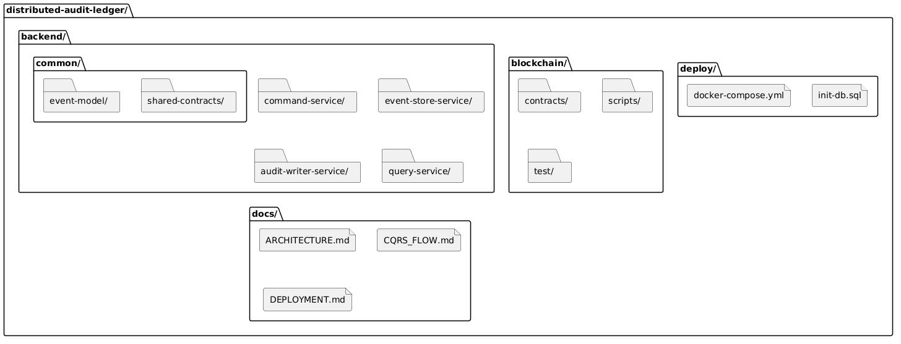

# Contributing to distributed-audit-ledger

Thanks for contributing. This guide defines the project workflow and contribution standards.

## Table of Contents

- Development Environment Setup
- Local Run Modes
- Post-start Smoke Checks
- Project Structure
- Coding Standards
- Branch Naming
- Commit Messages
- Pull Request Process
- Testing
- Docker Compose Quick Commands
- Troubleshooting Quick Checks
- Code Review Checklist

---

## Development Environment Setup

### Prerequisites

| Tool | Version |
|------|---------|
| Java (JDK) | 25+ |
| Maven | 3.9+ |
| Node.js | 20+ |
| Docker Desktop | recent stable |
| Git | 2.40+ |

### First-time setup

1. Clone repo and enter directory.
2. Start local infrastructure from `deploy/`.
3. Build backend modules.
4. Compile and test blockchain module.

PowerShell example:

```pwsh
Set-Location <repo-root>

Set-Location deploy
Copy-Item .env.example .env -ErrorAction SilentlyContinue
docker compose up -d

Set-Location ..\backend
mvn clean compile -DskipTests

Set-Location ..\blockchain
npm install
npm run compile
npm test
```

---

## Local Run Modes

### Option A: Run services from source

> **Important:** always launch services from the `backend/` reactor root using
> `-pl <module> -am` so Maven can resolve the sibling `common/*` modules.
> Running `mvn spring-boot:run` from inside a service directory will fail on a
> clean checkout because `event-model` / `shared-contracts` are not yet installed.

```pwsh
Set-Location <repo-root>\deploy
docker compose up -d

# Install shared modules once (from backend/)
Set-Location ..\backend
mvn clean install -pl common/event-model,common/shared-contracts -DskipTests

# Command Service (port 8081) — from backend/
mvn spring-boot:run -pl command-service -am
```

Run other services in separate terminals (all from `backend/`):

```pwsh
Set-Location <repo-root>\backend
mvn spring-boot:run -pl event-store-service -am
```

```pwsh
Set-Location <repo-root>\backend
mvn spring-boot:run -pl audit-writer-service -am
```

```pwsh
Set-Location <repo-root>\backend
mvn spring-boot:run -pl query-service -am
```

### Option B: Validate modules only

```pwsh
Set-Location <repo-root>\backend
mvn clean verify

Set-Location ..\blockchain
npm test
```

---

## Post-start Smoke Checks

```pwsh
Invoke-WebRequest http://localhost:8081/actuator/health
Invoke-WebRequest http://localhost:8082/actuator/health
Invoke-WebRequest http://localhost:8083/actuator/health
Invoke-WebRequest http://localhost:8084/actuator/health
```

Infra checks:

```pwsh
docker exec dal-kafka kafka-topics --bootstrap-server localhost:9092 --list
```

```pwsh
Invoke-WebRequest http://localhost:8545 -Method Post -ContentType "application/json" -Body '{"jsonrpc":"2.0","method":"eth_blockNumber","params":[],"id":1}'
```

---

## Project Structure



Source: `docs/diagrams/project-structure.puml`

---

## Coding Standards

### General

- Java 25.
- Spring Boot 4.
- WebFlux-first for backend HTTP APIs.
- Keep controllers thin; business logic in services.

### Reactive Conventions

- Keep request path reactive end-to-end (`Mono`/`Flux`).
- Avoid `.block()` in production code.
- `.block()` is acceptable in tests for setup/assertions.
- Do not call `subscribe()` in business request flow.

### Contracts and Schema

- Shared DTOs/events must live in `backend/common/*`.
- Postgres schema is `audit` (explicit in SQL and mappings).
- For blockchain write path changes, update `blockchain/test/AuditLedger.test.js` in the same change.

---

## Branch Naming

Mandatory convention for all issue branches:

```text
<type>/#XX-description
```

Allowed `type` values:

```text
feature | fix | docs | test
```

Examples:

```text
feature/#5-command-service-skeleton
fix/#7-retry-logic
docs/#12-architecture-update
test/#8-query-filters
```

---

## Commit Messages

Project convention:

```text
[#XX] short message
```

Examples:

```text
[#4] Setup backend multi-module pom
[#6] Add reactive Kafka consumer skeleton
[#12] Update deployment docs
```

---

## Pull Request Process

1. Branch from `main`.
2. Implement code and tests.
3. Run local validation.
4. Open PR with linked issue.
5. Address review comments.

PR description should include:

```markdown
## Description
<what changed>

## Closes
Closes #XX

## Related
Relates to #YY
```

---

## Testing

Backend:

```pwsh
Set-Location <repo-root>\backend
mvn test
mvn verify
```

Blockchain:

```pwsh
Set-Location <repo-root>\blockchain
npm test
```

Run a specific backend module:

```pwsh
Set-Location <repo-root>\backend
mvn -pl command-service test
```

---

## Docker Compose Quick Commands

```pwsh
Set-Location <repo-root>\deploy
docker compose up -d
docker compose ps
docker compose logs -f
docker compose down
docker compose down -v
```

---

## Troubleshooting Quick Checks

### Kafka not reachable

```pwsh
docker compose -f <repo-root>\deploy\docker-compose.yml ps
docker compose -f <repo-root>\deploy\docker-compose.yml logs kafka
```

### Postgres schema issues

```pwsh
docker compose -f <repo-root>\deploy\docker-compose.yml logs postgres
```

Verify table exists in `audit` schema (`audit.events`).

### Ganache / contract issues

```pwsh
docker compose -f <repo-root>\deploy\docker-compose.yml logs ganache
```

---

## Code Review Checklist

- [ ] Issue scope is clear and linked in PR (`Closes #XX`).
- [ ] Reactive flow preserved in backend request path.
- [ ] Shared contracts/events updated in `backend/common/*` if needed.
- [ ] Tests added or updated for behavior changes.
- [ ] `mvn verify` (backend) and `npm test` (blockchain) pass locally.
- [ ] Docs updated when architecture/workflow changed.
