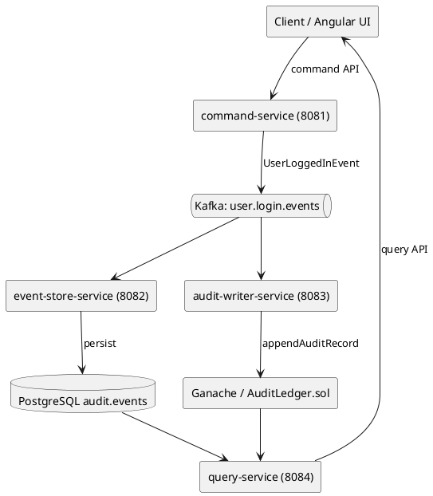

# Backend — Distributed Audit Ledger

Multi-module Maven project implementing the backend services for the Distributed Audit Ledger.

## Module overview

| Module | Port | Description |
|---|---|---|
| `common/event-model` | — | Shared domain event classes (`AuditEvent`, `UserLoggedInEvent`, `EventType`) |
| `common/shared-contracts` | — | Shared DTOs and API contracts (`UserLoginCommand`, `AuditEventDto`, `CommandResponse`) |
| `command-service` | **8081** | Reactive WebFlux API for commands; publishes domain events to Kafka |
| `event-store-service` | **8082** | Reactive Kafka consumer; persists events to PostgreSQL `audit.events` via R2DBC |
| `audit-writer-service` | **8083** | Consumes Kafka events, anchors SHA-256 hashes on Ganache via Web3j |
| `query-service` | **8084** | Reactive WebFlux read API for audit logs plus blockchain-backed integrity checks |

## Prerequisites

- Java 25+
- Maven 3.9+
- Running infrastructure: `cd ../deploy && docker compose up -d`

## Build

```bash
# From backend/ directory

# Compile & package all modules
mvn clean package -DskipTests

# Run tests (requires running Docker infrastructure for integration tests)
mvn clean verify

# Build only common modules
mvn clean install -pl common/event-model,common/shared-contracts
```

## Run individual services

Always run from the **`backend/`** root so Maven resolves sibling `common/*` modules
correctly. Without the `-am` flag (also-make) the build will fail on a clean checkout
because `event-model` and `shared-contracts` are not yet in the local repository.

```bash
# From backend/ directory (install common modules once, then run any service)
mvn clean install -pl common/event-model,common/shared-contracts -DskipTests

# Command Service (port 8081)
mvn spring-boot:run -pl command-service -am

# Event Store Service (port 8082)
mvn spring-boot:run -pl event-store-service -am

# Audit Writer Service (port 8083)
mvn spring-boot:run -pl audit-writer-service -am

# Query Service (port 8084)
mvn spring-boot:run -pl query-service -am
```

## Environment variables

Each service reads its configuration from `application.yml` with environment variable overrides.
Reactive PostgreSQL services (`event-store-service`, `query-service`) use R2DBC; `event-store-service` also uses JDBC-only Flyway for migrations:

| Variable | Default | Description |
|---|---|---|
| `KAFKA_BOOTSTRAP_SERVERS` | `localhost:9092` | Kafka broker address |
| `R2DBC_URL` | `r2dbc:postgresql://localhost:5432/audit_ledger` | Reactive PostgreSQL connection URL |
| `DB_URL` | `jdbc:postgresql://localhost:5432/audit_ledger` | PostgreSQL JDBC URL |
| `DB_USERNAME` | `postgres` | Database username |
| `DB_PASSWORD` | `postgres` | Database password |
| `GANACHE_RPC_URL` | `http://localhost:8545` | Ganache JSON-RPC endpoint |
| `AUDIT_LEDGER_CONTRACT_ADDRESS` | — | Deployed AuditLedger contract address |
| `AUDIT_LEDGER_CONTRACT_DEPLOYMENT_BLOCK` | `0` | Optional start block for integrity log scans (`0` = earliest, intended for local Ganache/dev only) |
| `GANACHE_PRIVATE_KEY` | — | Ethereum private key for signing transactions |

## Architecture

The diagram below shows the **target integration flow** for upcoming backend issues
(`#5` and beyond). In this PR (`#4`) only service skeletons and shared modules are
bootstrapped.



## Issue tracker

This module implements **Issue #4** in the roadmap / GitHub issue plan.
See [`docs/ROADMAP.md`](../docs/ROADMAP.md) for the full roadmap.
