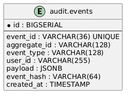

# Deploy — Local Infrastructure

This folder contains everything needed to run the **Distributed Audit Ledger** local stack.

## Services

| Container        | Image                             | Port  | Purpose                         |
|------------------|-----------------------------------|-------|---------------------------------|
| `dal-postgres`   | postgres:16                       | 5432  | Primary event-store database    |
| `dal-zookeeper`  | confluentinc/cp-zookeeper:7.6.1   | 2181  | Kafka coordination              |
| `dal-kafka`      | confluentinc/cp-kafka:7.6.1       | 9092  | Event streaming broker          |
| `dal-kafka-ui`   | provectuslabs/kafka-ui:v0.7.2     | 8080  | Kafka Web UI                    |
| `dal-ganache`    | trufflesuite/ganache:v7.9.1       | 8545  | Local Ethereum blockchain (RPC) |
| `dal-pgadmin`    | dpage/pgadmin4:8.7                | 5050  | PostgreSQL Web UI               |

## Quick Start

### 1. Prerequisites
- Docker ≥ 24.x
- Docker Compose ≥ 2.x

### 2. Create environment file
```bash
cp .env.example .env
# Edit .env if you need to change ports or credentials
```

### 3. Start all services
```bash
docker compose up -d
```

### 4. Wait for healthy state
```bash
docker compose ps
# All services should show "healthy" or "running"
```

### 5. Stop services
```bash
docker compose down          # keep volumes (data persists)
docker compose down -v       # remove volumes (clean reset)
```

## Verification

### PostgreSQL
```bash
# psql (requires psql client)
psql -h localhost -p 5432 -U postgres -d audit_ledger -c "\dt audit.*"

# Or via pgAdmin at http://localhost:5050
# Email:    admin@example.com
# Password: admin
# Server:   dal-postgres:5432
```

### Kafka
```bash
# List topics
docker exec dal-kafka kafka-topics --bootstrap-server localhost:9092 --list

# Create topic manually (auto-create is enabled)
docker exec dal-kafka kafka-topics \
  --bootstrap-server localhost:9092 \
  --create --topic user.login.events \
  --partitions 1 --replication-factor 1

# Or use Kafka UI at http://localhost:8080
```

### Ganache (local blockchain)
```bash
# Check RPC
curl -s -X POST http://localhost:8545 \
  -H "Content-Type: application/json" \
  --data '{"jsonrpc":"2.0","method":"eth_blockNumber","params":[],"id":1}'
# Expected: {"jsonrpc":"2.0","id":1,"result":"0x0"}

# List accounts
curl -s -X POST http://localhost:8545 \
  -H "Content-Type: application/json" \
  --data '{"jsonrpc":"2.0","method":"eth_accounts","params":[],"id":1}'
```

## Database Schema

The schema is applied automatically from `init-db.sql` on first start.



Source: `../docs/diagrams/database-schema.puml`

## Environment Variables

| Variable                  | Default              | Description               |
|---------------------------|----------------------|---------------------------|
| `POSTGRES_DB`             | `audit_ledger`       | Database name             |
| `POSTGRES_USER`           | `postgres`           | DB user                   |
| `POSTGRES_PASSWORD`       | `postgres`           | DB password               |
| `POSTGRES_PORT`           | `5432`               | Host port for PostgreSQL  |
| `ZOOKEEPER_PORT`          | `2181`               | Host port for Zookeeper   |
| `KAFKA_PORT`              | `9092`               | Host port for Kafka       |
| `GANACHE_PORT`            | `8545`               | Host port for Ganache     |
| `PGADMIN_PORT`            | `5050`               | Host port for pgAdmin     |
| `PGADMIN_DEFAULT_EMAIL`   | `admin@example.com`  | pgAdmin login email       |
| `PGADMIN_DEFAULT_PASSWORD`| `admin`              | pgAdmin login password    |

## Ganache Details

- **Chain ID:** 1337
- **Mnemonic:** `test test test test test test test test test test test junk`
- **Accounts:** 10 pre-funded accounts (100 ETH each)
- **RPC URL:** `http://localhost:8545`

This deterministic mnemonic ensures the same wallet addresses across restarts — useful for truffle/hardhat deployments.

## Troubleshooting

| Problem | Solution |
|---------|----------|
| Port already in use | Change port in `.env` and restart |
| Kafka not ready | Give it 30–60 s; check: `docker compose logs kafka` |
| Postgres data corrupted | `docker compose down -v` to wipe volumes, then restart |
| Ganache healthcheck fails | It may take a few seconds to boot; healthcheck retries 10x |
