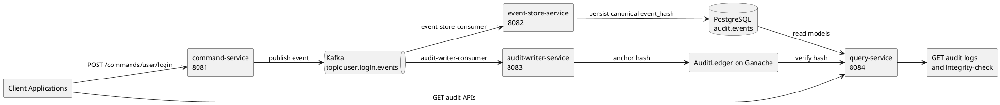
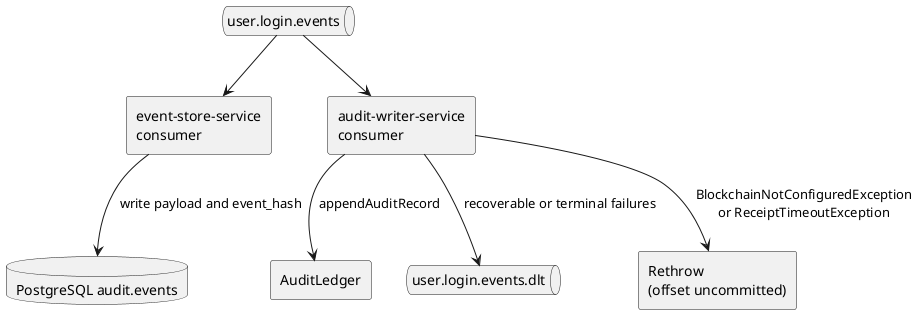
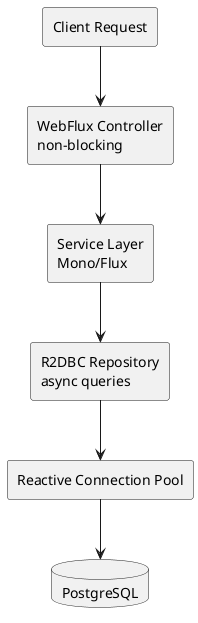

# Architecture Overview

This document describes the **Distributed Audit Ledger** system architecture using CQRS (Command Query Responsibility Segregation) + Event Sourcing + Blockchain Anchoring patterns.

## System Overview Diagram



## Core Pattern

The platform implements a **CQRS + Event Sourcing** architecture with blockchain-backed integrity:

1. **Command API** (`command-service`) receives business commands
2. **Event Emission** - commands are validated and transformed into immutable domain events
3. **Kafka Backbone** - events are published to `user.login.events` topic
   - Independent event-store consumer (persists to PostgreSQL)
   - Independent audit-writer consumer (anchors to blockchain)
4. **Query Service** - provides read API for audit logs with integrity status
5. **Blockchain Anchor** - event hashes are persisted on-chain for tamper-proof verification

## Component Boundaries

### Backend Services (Spring Boot + WebFlux)

| Service | Port | Purpose | Key Technology |
|---------|------|---------|-----------------|
| **command-service** | 8081 | Write-side API for commands | WebFlux, Kafka Producer |
| **event-store-service** | 8082 | Immutable event persistence | Kafka Consumer, R2DBC, Flyway |
| **audit-writer-service** | 8083 | Blockchain anchoring worker | Kafka Consumer, Web3j, Ganache |
| **query-service** | 8084 | Read-side API for audit logs | WebFlux, R2DBC, Dynamic Queries |

### Shared Backend Modules (Maven)

| Module | Purpose |
|--------|---------|
| **common/event-model** | Domain event classes (`AuditEvent`, `UserLoggedInEvent`, `EventType`) |
| **common/shared-contracts** | Shared DTOs (`UserLoginCommand`, `AuditEventDto`, `CommandResponse`) and `CanonicalObjectMapperFactory` |

### Blockchain Layer

- **AuditLedger.sol** - Solidity smart contract for append-only hash ledger
  - Owner-gated write access (`onlyOwner`)
  - Duplicate hash rejection (`DuplicateHash`)
  - Random read access for integrity checks
- **Ganache** - Local Ethereum-compatible development chain (chainId: 1337)
- **Hardhat** - Compilation, testing, and deployment framework

### Infrastructure

| Component | Purpose | Port |
|-----------|---------|------|
| **PostgreSQL 16** | Event store database (`audit` schema) | 5432 |
| **Kafka + Zookeeper** | Async event broker and coordination | 9092 / 2181 |
| **Ganache** | Local blockchain (RPC endpoint) | 8545 |
| **pgAdmin** | PostgreSQL administration UI | 5050 |
| **Kafka UI** | Kafka monitoring/management | 8080 |

## Data Flow & Integration Points

### Event Topic



### Database Schema

```sql
CREATE TABLE audit.events (
    id           BIGSERIAL    PRIMARY KEY,
    event_id     VARCHAR(36)  NOT NULL UNIQUE,     -- Stable UUID
    aggregate_id VARCHAR(128) NOT NULL,            -- derived key (for login: user:<userId>)
    event_type   VARCHAR(128) NOT NULL,            -- e.g., USER_LOGGED_IN
    user_id      VARCHAR(255),                     -- Denormalized for filtering
    payload      JSONB        NOT NULL,            -- Full event data
    event_hash   VARCHAR(64),                      -- SHA-256 (computed by event-store)
    created_at   TIMESTAMP    NOT NULL DEFAULT CURRENT_TIMESTAMP
);

-- Indexes for common queries
CREATE INDEX idx_events_aggregate_id ON audit.events (aggregate_id);
CREATE INDEX idx_events_event_type ON audit.events (event_type);
CREATE INDEX idx_events_user_id ON audit.events (user_id);
CREATE INDEX idx_events_created_at ON audit.events (created_at);
```

### Event Hash Computation

**Critical:** Both `event-store-service` and `audit-writer-service` must compute hashes identically:

```java
// ✅ CORRECT (ensures byte-identical JSON serialization)
ObjectMapper mapper = CanonicalObjectMapperFactory.create();
byte[] eventBytes = mapper.writeValueAsBytes(event);
MessageDigest digest = MessageDigest.getInstance("SHA-256");
String eventHash = HexFormat.of().formatHex(digest.digest(eventBytes));

// ❌ WRONG (silent hash mismatch)
ObjectMapper mapper = new ObjectMapper();  // Default ordering differs
byte[] wrongBytes = mapper.writeValueAsBytes(event);
String eventHash = HexFormat.of().formatHex(MessageDigest.getInstance("SHA-256").digest(wrongBytes));
```

Features of `CanonicalObjectMapperFactory`:
- Sorted JSON field keys (deterministic serialization)
- ISO-8601 `Instant` formatting
- No type headers
- Compact output

### Blockchain Contract

**AuditLedger.sol** - Immutable append-only ledger on Ganache:

```solidity
struct AuditRecord {
    bytes32 eventHash;      // SHA-256 of canonical event JSON
    uint256 timestamp;      // Seconds since epoch
    string eventType;       // e.g., "USER_LOGGED_IN"
    address source;         // Writer address (TODO: for future multi-writer support)
}

function appendAuditRecord(
    bytes32 _eventHash,
    uint256 _timestamp,
    string memory _eventType,
    address _source
) public onlyOwner {
    // ✅ Rejects duplicate hashes
    // ✅ Stores immutable record
}

function isHashExists(bytes32 _hash) public view returns (bool) {
    // Read-side query for integrity checks
}
```

## Reactive Architecture

All backend services are **reactive-first** with Spring WebFlux + Project Reactor, with controlled blocking in Kafka listeners where offset semantics require completion guarantees:



- **R2DBC** (Reactive Relational Database Connectivity) replaces JPA
- `event-store-service` Kafka consumer blocks on `persist(...).block()` so Kafka offset commit is aligned with DB write outcome
- `audit-writer-service` uses Web3j (blocking RPC) behind Kafka error-handler retries/backoff
- Backpressure handling via Flux operators on read APIs
- Database queries use dynamic SQL (not ORM) for performance

## Documentation Map

| Document | Purpose |
|----------|---------|
| **docs/ARCHITECTURE.md** | This file: component boundaries and integration |
| **docs/CQRS_FLOW.md** | Step-by-step runtime flow with examples |
| **docs/DEPLOYMENT.md** | Quickstart guide and deployment workflows |
| **docs/TESTING_SCENARIOS.md** | Curl commands and smoke test scripts |
| **deploy/README.md** | Infrastructure (Docker Compose) setup and troubleshooting |
| **backend/README.md** | Backend module build/run instructions |
| **blockchain/README.md** | Blockchain module compile/test/deploy |

## Key Design Decisions

1. **CQRS Split**: Separate write (command-service) and read (query-service) paths decouple scaling constraints
2. **Event Sourcing**: Kafka + PostgreSQL provides immutable event log and temporal query capability
3. **Blockchain Anchoring**: Event hashes on-chain provide a tamper-evident trail independent of DB
4. **Async Consumers**: Two independent Kafka consumers (event-store, audit-writer) allow independent failure handling
5. **Reactive Stack**: WebFlux + R2DBC minimize thread context switches and connection pool pressure
6. **Canonical JSON**: Deterministic serialization (sorted fields) ensures DB and blockchain hashes match
7. **Dead-Letter Topic**: DLT is used for recoverable/terminal errors; configuration/receipt-timeout failures are rethrown to keep source offsets uncommitted
