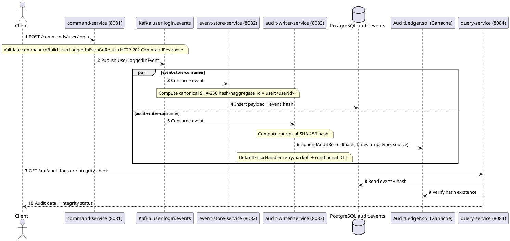

# CQRS Runtime Flow

This document describes the runtime sequence from command ingestion through event persistence, blockchain anchoring, and read-side querying.

## End-to-End Sequence Diagram



## Step-by-Step Flow

### 1) Command acceptance

Request:

```http
POST /commands/user/login
Content-Type: application/json

{
  "userId": "alice@example.com",
  "ipAddress": "192.0.2.1",
  "userAgent": "Mozilla/5.0"
}
```

Note: `ipAddress` and `userAgent` in body are fallback values. In normal HTTP requests, command-service prefers server-derived remote IP and `User-Agent` header.

Validation:
- `userId` is required
- `ipAddress`, `userAgent` are optional

Command response shape (`CommandResponse`):

```json
{
  "success": true,
  "message": "Command accepted",
  "eventId": "550e8400-e29b-41d4-a716-446655440000"
}
```

### 2) Kafka publish contract

Topic: `user.login.events`

Produced event (`UserLoggedInEvent`) fields:

```json
{
  "eventId": "550e8400-e29b-41d4-a716-446655440000",
  "eventType": "USER_LOGGED_IN",
  "occurredAt": "2026-05-18T12:00:00Z",
  "sourceService": "command-service",
  "userId": "alice@example.com",
  "ipAddress": "192.0.2.1",
  "userAgent": "Mozilla/5.0"
}
```

### 3) Event-store processing

Implementation behavior (simplified to actual semantics):

```java
@KafkaListener(topics = "${kafka.topics.user-login-events}")
public void consume(AuditEvent event, String key) {
    if (!(event instanceof UserLoggedInEvent loginEvent)) {
        return;
    }

    // Offset commit follows DB write result.
    eventPersistenceService.persist(loginEvent).block();
}
```

Persistence details:
- `aggregate_id` is derived as `user:<userId>` for `UserLoggedInEvent`
- `event_hash` is computed before insert
- `created_at` comes from `occurredAt` (fallback: now)

Insert example:

```sql
INSERT INTO audit.events
  (event_id, aggregate_id, event_type, user_id, payload, event_hash, created_at)
VALUES
  ('550e8400-e29b-41d4-a716-446655440000',
   'user:alice@example.com',
   'USER_LOGGED_IN',
   'alice@example.com',
   '{"eventId":"550e8400...","eventType":"USER_LOGGED_IN","occurredAt":"2026-05-18T12:00:00Z","sourceService":"command-service","userId":"alice@example.com","ipAddress":"192.0.2.1","userAgent":"Mozilla/5.0"}'::jsonb,
   'abc123def456...',
   '2026-05-18 12:00:00');
```

### 4) Audit-writer processing

Implementation semantics:
- computes same canonical hash as event-store
- writes hash to blockchain via Web3j
- listener errors are handled by configured `DefaultErrorHandler`

Error handling outcomes after retries:
- sends to DLT (`user.login.events.dlt`) for recoverable/terminal failures
- rethrows (no DLT, offset stays uncommitted) for:
  - `BlockchainNotConfiguredException`
  - `ReceiptTimeoutException`

### 5) Query/read-side responses

`GET /api/audit-logs` returns `AuditEventDto[]`:

```json
[
  {
    "id": 1,
    "eventId": "550e8400-e29b-41d4-a716-446655440000",
    "eventType": "USER_LOGGED_IN",
    "userId": "alice@example.com",
    "occurredAt": "2026-05-18T12:00:00Z",
    "eventDataJson": "{\"eventId\":\"550e8400...\",\"eventType\":\"USER_LOGGED_IN\",\"occurredAt\":\"2026-05-18T12:00:00Z\",\"sourceService\":\"command-service\",\"userId\":\"alice@example.com\",\"ipAddress\":\"192.0.2.1\",\"userAgent\":\"Mozilla/5.0\"}",
    "eventHash": "abc123def456...",
    "integrityStatus": "PENDING"
  }
]
```

For live on-chain status, use `GET /api/audit-logs/{id}/integrity-check`.

Repository ordering for list endpoint:
- `ORDER BY created_at DESC, id DESC`

## Integrity-check semantics

`GET /api/audit-logs/{id}/integrity-check`

Statuses:
- `ON_CHAIN`: DB hash exists and contract confirms it
- `MISMATCH`: DB hash exists but contract does not confirm it (includes delayed/failed anchoring and true mismatch)
- `PENDING`: DB hash is blank (`event_hash` missing)

## Failure Scenarios

### A) Kafka publish failure in command-service

- command creation succeeds
- Kafka publish fails
- API returns `503 Service Unavailable` via `CommandPublishException` mapping

### B) DB persistence failure in event-store

- event consumed
- DB write fails
- listener throws and offset is not advanced until retry/redelivery path succeeds

### C) Blockchain write failure in audit-writer

- default handler retries with backoff
- then either:
  - DLT publish for recoverable/terminal errors, or
  - exception rethrow for `BlockchainNotConfiguredException` / `ReceiptTimeoutException`

## Guarantees (current implementation)

1. At-least-once delivery via Kafka consumer groups
2. Event-store idempotency through `UNIQUE(event_id)`
3. Canonical hash parity between DB and blockchain writers (`CanonicalObjectMapperFactory`)
4. Decoupled consumers: DB persistence and blockchain anchoring are independent
5. Deterministic query ordering: `created_at DESC, id DESC`

## Related Docs

- `docs/ARCHITECTURE.md`
- `docs/DEPLOYMENT.md`
- `docs/TESTING_SCENARIOS.md`
- `deploy/README.md`
- `backend/README.md`
