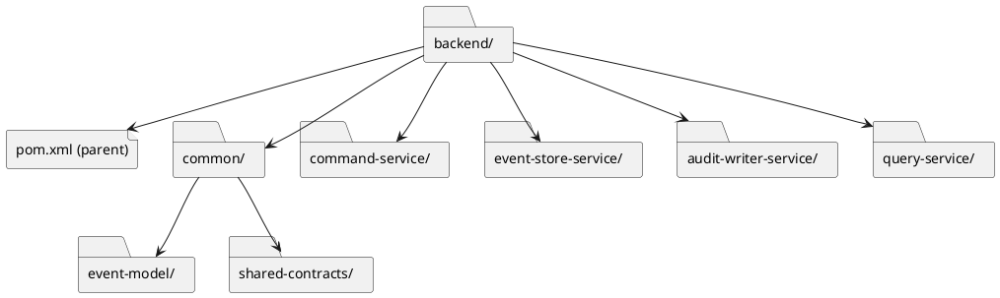
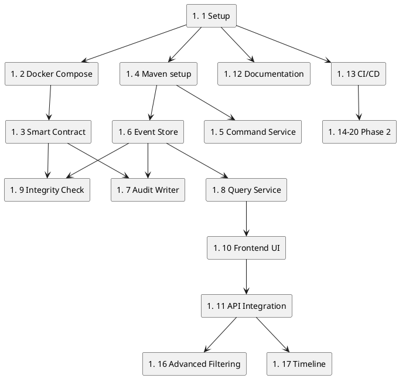

# GitHub Issue Plan for Distributed Audit Ledger

## Issue Structure

All issues will be connected through:
- Labels: `backend`, `blockchain`, `frontend`, `infra`, `docs`
- Project Board: to track status (`TODO`, `In Progress`, `Done`)
- PR links: each issue should be linked from a PR via `Closes #XX` or `Relates to #XX`

---

## MVP Phase (Phase 1) — ✅ COMPLETE (Issues #1–#13)

### 1. [SETUP] Repository Initialization
**ID:** #1  
**Labels:** `infra`, `docs`  
**Description:**
- Create the base directory structure defined by the architecture
- Initialize the main configuration files
- Add `LICENSE` (MIT)
- Write an initial `README.md`
- Add `.gitignore` entries for Java, Node.js, and Solidity

**Subtasks:**
- [x] #1.1 - Create folder structure
- [x] #1.2 - Initialize the Git repository
- [x] #1.3 - Create the initial `README` and `LICENSE`

**Expected PR:** PR-1 (Initial repository setup)

---

### 2. [INFRA] Docker Compose for Infrastructure
**ID:** #2  
**Labels:** `infra`  
**Depends on:** #1  
**Description:**
Set up `docker-compose` with the core services:
- PostgreSQL (port 5432)
- Kafka + Zookeeper
- Ganache (local blockchain, port 8545)
- pgAdmin (for database management)

**Acceptance Criteria:**
- `docker-compose up` starts all services
- The database accepts connections
- Kafka is available on port 9092
- Ganache is ready for contract deployment

**Subtasks:**
- [x] #2.1 - `docker-compose.yml` with all services
- [x] #2.2 - `.env` files with configuration
- [x] #2.3 - Database initialization scripts (schema)
- [x] #2.4 - `README` for starting the infrastructure stack

**Expected PR:** PR-2 (Docker Compose setup)

---

### 3. [BLOCKCHAIN] AuditLedger Smart Contract
**ID:** #3  
**Labels:** `blockchain`  
**Depends on:** #2  
**Description:**
Implement a Solidity smart contract for storing event hashes.

**Requirements:**
```solidity
contract AuditLedger {
  struct AuditRecord {
    bytes32 eventHash;
    uint256 timestamp;
    string eventType;
    address source;
  }
  
  function appendAuditRecord(bytes32 _hash, uint256 _timestamp, string memory _eventType, address _source) public
  function getRecord(uint256 _index) public view returns (AuditRecord)
  function getRecordsCount() public view returns (uint256)
  function isHashExists(bytes32 _hash) public view returns (bool)
}
```

**Subtasks:**
- [x] #3.1 - Write the `AuditLedger.sol` contract
- [x] #3.2 - Write tests (Hardhat)
- [x] #3.3 - Create the deployment script
- [x] #3.4 - Document the contract

**Expected PR:** PR-3 (Smart contract implementation)

---

### 4. [BACKEND] Maven Project Initialization
**ID:** #4  
**Labels:** `backend`, `infra`  
**Depends on:** #1, #2  
**Description:**
Create a multi-module Maven project for the backend services.

**Structure:**


**Subtasks:**
- [x] #4.1 - Create the parent `pom.xml` with shared dependencies
- [x] #4.2 - Create the common modules
- [x] #4.3 - Create service skeletons

**Expected PR:** PR-4 (Maven project structure)

---

### 5. [BACKEND] Command Service - Skeleton
**ID:** #5  
**Labels:** `backend`  
**Depends on:** #4, #2  
**Description:**
Build the initial Command Service: a Spring Boot application with a REST API for accepting commands.

**Requirements:**
- Spring Boot 4.x + WebFlux setup
- REST controller: `POST /commands/user/login`
- Kafka producer for publishing events
- Simple in-memory event storage (to be replaced with the database later)

**Acceptance Criteria:**
- The service starts on port 8081
- A POST request can be sent with `curl -X POST http://localhost:8081/commands/user/login -H "Content-Type: application/json" -d '{"userId": "user1"}'`
- The event is published to the Kafka topic `user.login.events`

**Subtasks:**
- [x] #5.1 - Spring Boot application with Kafka producer
- [x] #5.2 - REST endpoint for the `UserLoggedIn` event
- [x] #5.3 - Event DTO class
- [x] #5.4 - `application.yml` and configuration

**Expected PR:** PR-5 (Command Service skeleton)

---

### 6. [BACKEND] Event Store - Database Write Service
**ID:** #6  
**Labels:** `backend`  
**Depends on:** #4, #2  
**Description:**
Create a service that reads events from Kafka and persists them to PostgreSQL.

**Requirements:**
- Spring Boot application
- Kafka consumer subscribed to `user.login.events`
- Spring Data R2DBC for database persistence
- `audit.events` table (`id`, `event_id`, `aggregate_id`, `event_type`, `user_id`, `payload`, `created_at`, `event_hash`)

**Schema:**
```sql
CREATE TABLE audit.events (
  id BIGSERIAL PRIMARY KEY,
  event_id VARCHAR(36) NOT NULL UNIQUE,
  aggregate_id VARCHAR(128) NOT NULL,
  event_type VARCHAR(128) NOT NULL,
  user_id VARCHAR(255),
  payload JSONB NOT NULL,
  event_hash VARCHAR(64),
  created_at TIMESTAMP NOT NULL DEFAULT CURRENT_TIMESTAMP
);
```

**Subtasks:**
- [x] #6.1 - Spring Boot + Spring Data R2DBC setup
- [x] #6.2 - Entity class and repository
- [x] #6.3 - Kafka consumer
- [x] #6.4 - Liquibase / Flyway migrations
- [x] #6.5 - Tests

**Expected PR:** PR-6 (Event Store service)

---

### 7. [BACKEND] Audit Writer Service
**ID:** #7  
**Labels:** `backend`, `blockchain`  
**Depends on:** #3, #6, #2  
**Description:**
Create a service that writes event hashes to the blockchain.

**Requirements:**
- Kafka consumer on the same topic: `user.login.events`
- SHA-256 event hash calculation
- Web3j client for interacting with Ganache
- Call `appendAuditRecord` on the smart contract
- Robust transaction and error handling

**Subtasks:**
- [x] #7.1 - Web3j setup and configuration for Ganache
- [x] #7.2 - Contract wrapper (ABI-aligned bindings)
- [x] #7.3 - Kafka consumer with event processing
- [x] #7.4 - Hash calculation and blockchain write logic
- [x] #7.5 - Retry mechanism on failure
- [x] #7.6 - Tests with Testcontainers

**Expected PR:** PR-7 (Audit Writer Service)

---

### 8. [BACKEND] Query Service - MVP
**ID:** #8  
**Labels:** `backend`  
**Depends on:** #6, #2  
**Description:**
Create a Query Service with a REST API for retrieving event history.

**Endpoints:**
- `GET /api/audit-logs` - list events with filters
- `GET /api/audit-logs/{id}` - event details
- Query parameters: `?userId=...&eventType=...&from=...&to=...`

**Subtasks:**
- [x] #8.1 - Spring Boot WebFlux setup + reactive filtering/query layer
- [x] #8.2 - REST controllers
- [x] #8.3 - DTOs and MapStruct mappers
- [x] #8.4 - Reactive filtering/query logic (`R2DBC repository` / `DatabaseClient`)
- [x] #8.5 - Tests

**Expected PR:** PR-8 (Query Service MVP)

---

### 9. [BACKEND] Event Integrity Check
**ID:** #9  
**Labels:** `backend`, `blockchain`  
**Depends on:** #7, #8  
**Description:**
Add an endpoint that verifies whether an event hash exists on the blockchain.

**Endpoint:**
- `GET /api/audit-logs/{id}/integrity-check` → verify the hash against the contract

**Response:**
```json
{
  "auditLogId": 1,
  "eventId": "uuid-string",
  "eventHash": "abc123...",
  "blockchainRecord": {
    "exists": true,
    "transactionHash": "0x...",
    "blockNumber": 12345,
    "timestamp": 1234567890
  },
  "status": "ON_CHAIN"
}
```

> Possible `status` values: `ON_CHAIN` (the hash was found on the blockchain), `MISMATCH` (the hash exists in the database but not on-chain), and `PENDING` (the hash has not yet been written to the blockchain — the `event_hash` field is missing in the database).

**Subtasks:**
- [x] #9.1 - Web3j client for reading from the contract
- [x] #9.2 - Service for hash verification
- [x] #9.3 - REST endpoint
- [x] #9.4 - Integration tests (`SpringBootTest` + `Testcontainers` PostgreSQL: 11 scenarios — `ON_CHAIN`, `MISMATCH`, `PENDING`, `404`, `503`, `500`, query filters)

**Expected PR:** PR-9 (Integrity check endpoint)

---

### 10. [FRONTEND] Basic Angular UI
**ID:** #10  
**Labels:** `frontend`  
**Depends on:** #8  
**Description:**
Create an Angular application with a basic audit log table.

**Requirements:**
- Angular 17+
- Material Design components
- Event table with columns: ID, Event Type, User, Time, Integrity Status
- Filters by event type and user
- Detailed event view (drawer / modal)

**Subtasks:**
- [x] #10.1 - Angular project setup (`ng new`)
- [x] #10.2 - Material modules setup
- [x] #10.3 - Components for the table and filters
- [x] #10.4 - HTTP client for Query Service
- [x] #10.5 - Routing and layout
- [x] #10.6 - Styling and responsive design

**Expected PR:** PR-10 (Angular UI skeleton)

---

### 11. [FRONTEND] Integration with Backend API
**ID:** #11  
**Labels:** `frontend`  
**Depends on:** #10, #8, #9  
**Description:**
Integrate the frontend with the Query Service and Integrity Check APIs.

**Requirements:**
- Angular `HttpClient` for requests
- RxJS observables for handling asynchronous data
- Event table with real data from the database
- Integrity indicator in the table (`OK` / `MISMATCH`)
- Detailed view with blockchain record verification

**Subtasks:**
- [x] #11.1 - Services for HTTP requests
- [x] #11.2 - Models / interfaces for typing
- [x] #11.3 - Table with live data
- [x] #11.4 - Pagination and lazy loading
- [x] #11.5 - Error handling and loading states
- [x] #11.6 - Unit tests

**Expected PR:** PR-11 (Frontend API integration)

---

### 12. [DOCS] Architecture Documentation
**ID:** #12  
**Labels:** `docs`  
**Depends on:** #1  
**Description:**
Write detailed architecture documentation with diagrams.

**Files:**
- `docs/ARCHITECTURE.md` - overview of all components
- `docs/CQRS_FLOW.md` - flow diagram
- `docs/DEPLOYMENT.md` - deployment instructions
- `docs/TESTING_SCENARIOS.md` - live demo scenarios

**Subtasks:**
- [x] #12.1 - `ARCHITECTURE.md` with diagrams (ASCII art)
- [x] #12.2 - `CQRS_FLOW.md` - step-by-step flow with examples
- [x] #12.3 - `DEPLOYMENT.md` - quickstart guide
- [x] #12.4 - `TESTING_SCENARIOS.md` - curl commands and screenshots ✅ screenshot pack added

**Expected PR:** PR-12 (Architecture documentation) ✅ Implemented via PR #124

---

### 13. [INFRA] CI/CD Pipeline
**ID:** #13  
**Labels:** `infra`  
**Depends on:** #4, #5, #6, #7, #8, #10  
**Description:**
Set up GitHub Actions for automated testing and builds.

**Pipeline (expanded):**
- Backend: `mvn clean verify` from `backend/` (including `common/*` and all services)
- Frontend: `npm test` + `npm run build` from `frontend/audit-ui/`
- Blockchain: `hardhat test` from `blockchain/`
- SonarQube: analysis of all source code (backend + frontend + blockchain)
- Telegram: channel notification with the outcome of every pipeline phase

**Acceptance Criteria:**
- On `push` to `main` and on `pull_request`, backend/frontend/blockchain checks run
- The SonarQube job runs when `SONAR_TOKEN` and project variables are configured
- A Telegram notification is sent at the end of the pipeline and includes the status of the key jobs
- If Telegram secrets and/or the Sonar token are missing, the pipeline does not fail (those steps are marked as skipped)
- Requirements and subtasks are synchronized between `docs/ROADMAP.md`, GitHub Issue #13, and GitHub Project

**Subtasks:**
- [x] #13.1 - Backend test workflow (Maven)
- [x] #13.2 - Frontend test/build workflow (npm)
- [x] #13.3 - Blockchain test workflow (Hardhat)
- [x] #13.4 - SonarQube phase for backend sources
- [x] #13.5 - SonarQube phase for frontend sources
- [x] #13.6 - SonarQube phase for blockchain sources
- [x] #13.7 - Telegram notification job for full pipeline status
- [x] #13.8 - Synchronize subtasks in GitHub Issue #13 and the GitHub Project board

**Expected PR:** PR-13 (CI/CD setup)

---

## Phase 2 - Extensions

### 14. [BACKEND] Support for Additional Event Types
**ID:** #14  
**Labels:** `backend`  
**Depends on:** #5, #6  
**Description:**
Add support for the following event types:
- `UserProfileChanged`
- `EntityCreated`
- `EntityUpdated`
- `DataDeleted`

**Subtasks:**
- [x] #14.1 - Event DTO classes for the new types
- [x] #14.2 - Command endpoints
- [x] #14.3 - Database schema updates
- [x] #14.4 - Tests

**Expected PR:** PR-14 (Event type expansion)

---

### 15. [BACKEND] Authentication & Authorization
**ID:** #15  
**Labels:** `backend`, `frontend`  
**Depends on:** #5, #8, #10  
**Description:**
Add JWT-based authentication and role-based authorization.

**Requirements:**
- Spring Security + JWT tokens
- Roles: `AUDITOR`, `ADMIN`, `USER`
- Login endpoint: `POST /auth/login`
- Token-based requests

**Subtasks:**
- [x] #15.1 - Spring Security setup
- [x] #15.2 - JWT token generation and validation
- [x] #15.3 - Login endpoint
- [x] #15.4 - Role-based access control
- [x] #15.5 - Frontend authentication service
- [x] #15.6 - Protected routes in Angular

**Expected PR:** PR-15 (Authentication & Authorization)

---

### 16. [FRONTEND] Advanced Filtering and Search
**ID:** #16  
**Labels:** `frontend`  
**Depends on:** #11  
**Status:** ✅ Done  
**Description:**
Enhance the UI with advanced search and filtering.

**Features:**
- Full-text search across event content
- Date-range picker
- Multiple filters applied at the same time
- Persist filters in the URL
- Export to CSV

**Subtasks:**
- [x] #16.1 - Query parameters in the URL
- [x] #16.2 - Advanced filter components
- [x] #16.3 - Date-range picker
- [x] #16.4 - Export functionality
- [x] #16.5 - State management (`localStorage`)

**Expected PR:** PR-16 (Advanced filtering)

---

### 17. [FRONTEND] Event Timeline Visualization
**ID:** #17  
**Labels:** `frontend`  
**Depends on:** #16  
**Status:** ✅ Done  
**Description:**
Add a timeline view for events.

**Features:**
- Event timeline
- Grouping by day and hour
- Interactive timeline points
- Quick navigation between events

**Acceptance Criteria:**
- The timeline view displays events from the current result set, grouped by day and hour
- Clicking an event opens a drawer with details and integrity verification
- The layout remains usable on mobile devices
- Test coverage for new or changed frontend code is at least 80%

**Subtasks:**
- [x] #17.1 - Timeline component
- [x] #17.2 - Event grouping logic
- [x] #17.3 - Styling and animations
- [x] #17.4 - Responsive behavior on mobile
- [x] #17.5 - Unit tests and coverage >= 80%

**Expected PR:** PR-17 (Timeline visualization)

---

### 18. [BACKEND] Reconciliation Service
**ID:** #18  
**Labels:** `backend`  
**Depends on:** #9, #14  
**Status:** ✅ Done  
**Description:**
Create a service that verifies the integrity of all records and identifies compromised data.

**Features:**
- Batch verification of all events
- Mismatch report
- Scheduled automatic execution (Quartz)
- Endpoint for manual verification

**Subtasks:**
- [x] #18.1 - Batch integrity checker logic
- [x] #18.2 - Scheduled task setup (Quartz)
- [x] #18.3 - Reconciliation report service
- [x] #18.4 - REST endpoint to trigger verification
- [x] #18.5 - Tests

**Expected PR:** PR-18 (Reconciliation Service)

---

### 19. [INFRA] Kubernetes Manifests
**ID:** #19  
**Labels:** `infra`  
**Depends on:** #13  
**Status:** ✅ Done  
**Description:**
Create Kubernetes deployment manifests for production.

**Resources:**
- Deployment for each service
- Services, ConfigMaps, Secrets
- Helm chart
- Ingress configuration

**Subtasks:**
- [x] #19.1 - Kubernetes deployments for backend services
- [x] #19.2 - Kubernetes deployments for the frontend
- [x] #19.3 - ConfigMaps and StatefulSets for Kafka/PostgreSQL
- [x] #19.4 - Helm chart
- [x] #19.5 - Ingress setup

**Expected PR:** PR-19 (Kubernetes deployment)

---

### 20. [DOCS] Live Demo Scenario
**ID:** #20  
**Labels:** `docs`  
**Depends on:** #12, #18  
**Status:** ✅ Done  
**Description:**
Prepare a polished demo scenario for interviews.

**Content:**
- Step-by-step instructions
- Shell/curl commands for testing
- UI screenshots
- Rationale behind key architecture decisions
- Potential questions and answers

**Subtasks:**
- [x] #20.1 - Write the guide
- [x] #20.2 - Prepare curl commands
- [x] #20.3 - Prepare UI screenshots
- [x] #20.4 - Q&A document

**Expected PR:** PR-20 (Demo scenario documentation)

**Deliverables:**
- `docs/LIVE_DEMO_QA.md`
- `docs/TESTING_SCENARIOS.md`

---

## Labels Reference

| Label | Description |
|-------|-------------|
| `backend` | Java/Spring backend work |
| `blockchain` | Solidity/Web3 work |
| `frontend` | Angular/TypeScript work |
| `infra` | Docker, Kubernetes, CI/CD |
| `docs` | Documentation |
| `bug` | Bug or issue |
| `enhancement` | Improvement to an existing feature |
| `question` | Question or discussion |

---

## Dependency Graph



---

## Migration Path (PR Linking)

Each PR must be linked to an issue via:
```
Closes #XX
Relates to #YY
```

**Example PR description:**

````markdown
## Description
This PR implements a basic Command Service with a Kafka producer.

## Closes
- Closes #5

## Related
- Relates to #4
- Relates to #2 (Docker Compose)

## Checklist
- [ ] Code follows style guidelines
- [ ] Self-review completed
- [ ] Comments added for complex logic
- [ ] Tests added or updated
- [ ] Documentation updated

## Testing
Steps to verify:
```bash
mvn clean test
curl -X POST http://localhost:8081/commands/user/login ...
```

## Screenshots (if applicable)
<!-- Add screenshots here -->
````

---

## Notes

1. **Phase order:** The MVP phase must be complete before Phase 2 begins
2. **Branching strategy:** Each issue should use a branch named `<type>/#XX-description`, where `type` = `feature|fix|docs|test`
3. **PR reviews:** At least 1 approval is required before merge
4. **Commit messages:** `[#XX] Brief description` (including the issue number)
5. **Project board:** Use GitHub Projects to visualize status
