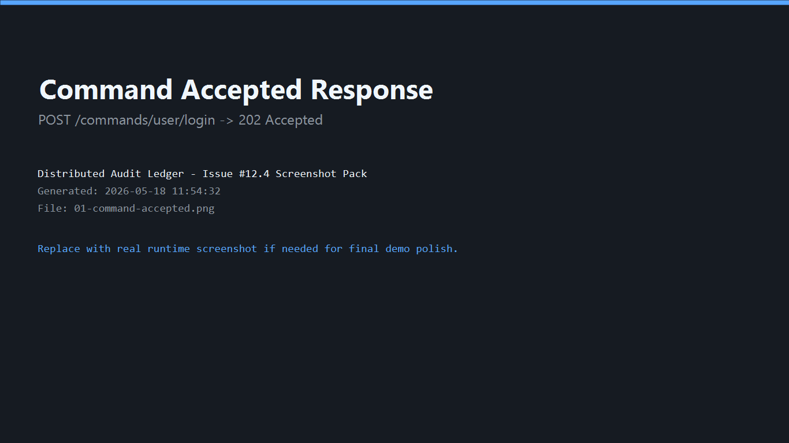
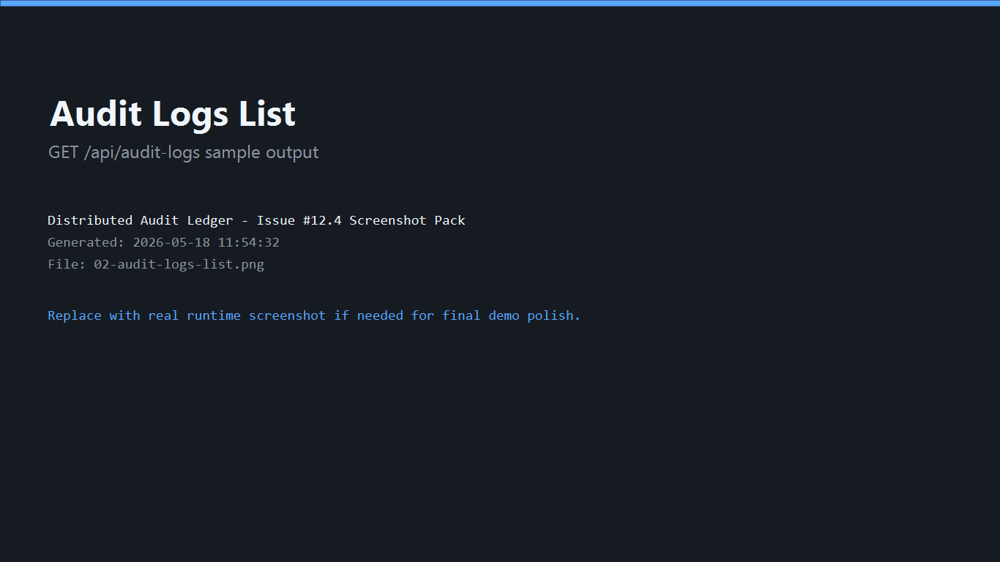
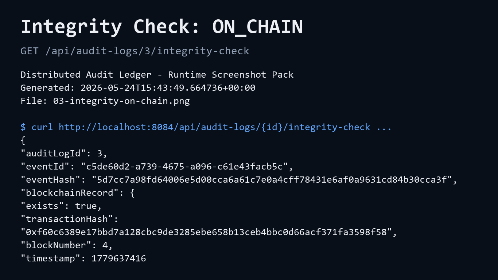
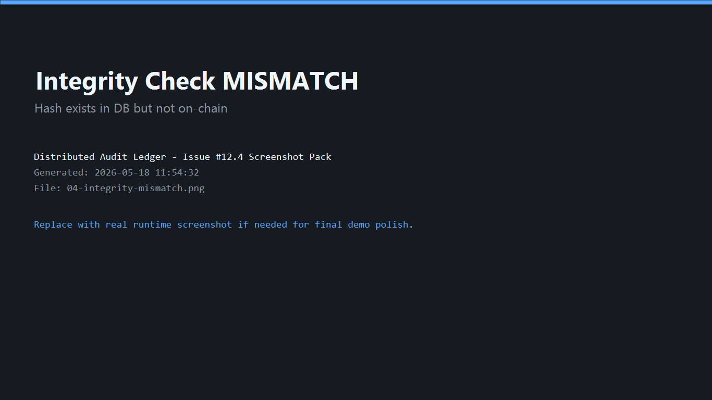
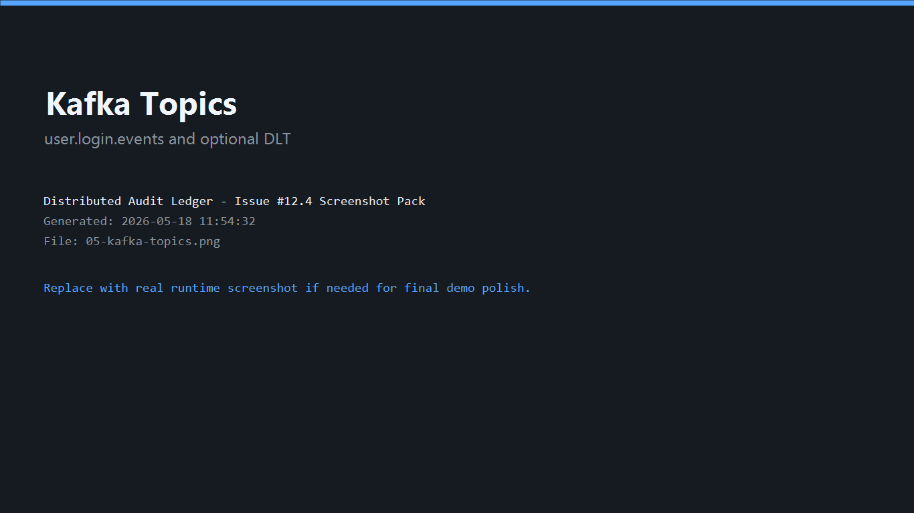
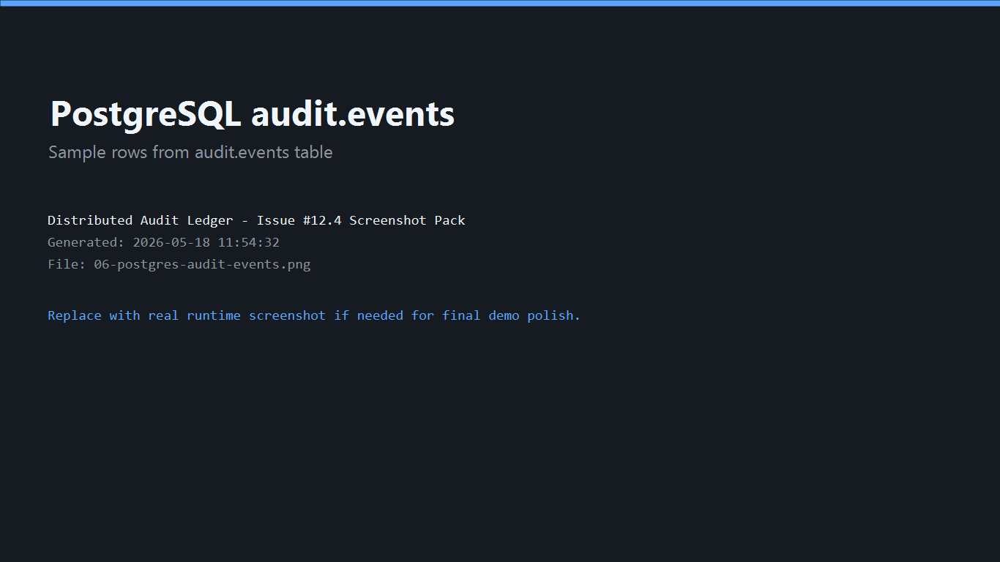
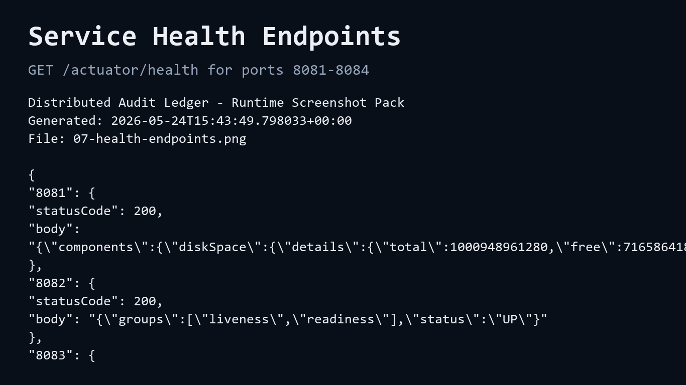
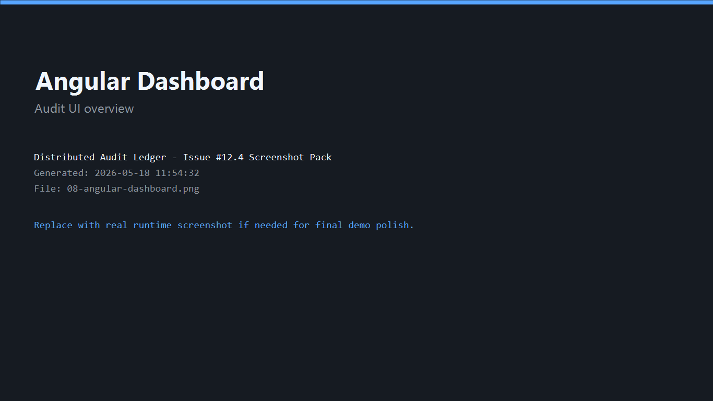

# Testing Scenarios

This document provides practical curl commands and test scenarios to verify the Distributed Audit Ledger is working correctly. All examples assume local development setup (services on localhost, ports 8081–8084).

## Prerequisites

- All services running (see `docs/DEPLOYMENT.md`)
- Docker Compose stack healthy
- PostgreSQL, Kafka, Ganache accessible
- `jq` installed (used for parsing `eventId` / `AUDIT_ID` and formatting responses)

## Scenario 1: Basic Event Ingestion (No Blockchain)

**Goal**: Send a command and verify it reaches the database.

### 1.1 Send Login Command

```bash
RESPONSE=$(curl -X POST http://localhost:8081/commands/user/login \
  -H "Content-Type: application/json" \
  -d '{
    "userId": "alice@example.com",
    "ipAddress": "192.0.2.1",
    "userAgent": "curl/7.81.0"
  }')

echo $RESPONSE | jq .
# Expected:
# {
#   "success": true,
#   "message": "Command accepted",
#   "eventId": "550e8400-e29b-41d4-a716-446655440000"
# }

# Note: body `ipAddress` / `userAgent` are fallback values; service usually persists server-derived remote IP and request `User-Agent`.

# Capture eventId for later use
EVENT_ID=$(echo $RESPONSE | jq -r '.eventId')
echo "Event ID: $EVENT_ID"
```

### 1.2 Wait for Event Store Consumer

```bash
# Give event-store-service 1–2 seconds to process
sleep 2
```

### 1.3 Query Event from Database

```bash
# Check if event was persisted
curl "http://localhost:8084/api/audit-logs?userId=alice@example.com" | jq .

# Expected output:
# [
#   {
#     "id": 1,
#     "eventId": "550e8400-e29b-41d4-a716-446655440000",
#     "eventType": "USER_LOGGED_IN",
#     "userId": "alice@example.com",
#     "occurredAt": "2026-05-18T12:00:00Z",
#     "eventDataJson": "{...}",
#     "eventHash": "abc123def456789...",
#     "integrityStatus": "PENDING"
#   }
# ]
```

### 1.4 Query Single Event by ID

```bash
# Resolve DB id by eventId first (works on non-empty databases)
AUDIT_ID=$(curl "http://localhost:8084/api/audit-logs?userId=alice@example.com&limit=50" | jq -r --arg eid "$EVENT_ID" '.[] | select(.eventId==$eid) | .id' | head -n 1)

curl "http://localhost:8084/api/audit-logs/${AUDIT_ID}" | jq .

# Same structure as above, but single object (not array)
```

---

## Scenario 2: Filtering & Pagination

**Goal**: Test query parameters for filtering, sorting, and pagination.

### 2.1 Send Multiple Events

```bash
# Event 1
curl -X POST http://localhost:8081/commands/user/login \
  -H "Content-Type: application/json" \
  -d '{"userId": "alice@example.com"}'

sleep 1

# Event 2
curl -X POST http://localhost:8081/commands/user/login \
  -H "Content-Type: application/json" \
  -d '{"userId": "bob@example.com"}'

sleep 1

# Event 3
curl -X POST http://localhost:8081/commands/user/login \
  -H "Content-Type: application/json" \
  -d '{"userId": "alice@example.com"}'

sleep 2
```

### 2.2 Query by User ID

```bash
# All events for alice
curl "http://localhost:8084/api/audit-logs?userId=alice@example.com" | jq '.[] | .userId'

# Expected output:
# "alice@example.com"
# "alice@example.com"
```

### 2.3 Query by Event Type

```bash
FROM=$(date -u -d '10 minutes ago' +'%Y-%m-%dT%H:%M:%SZ')
curl "http://localhost:8084/api/audit-logs?eventType=USER_LOGGED_IN&userId=alice@example.com&from=${FROM}" | jq '.[] | .eventType'

# Expected output:
# "USER_LOGGED_IN"  (for returned rows in this filtered window)
```

### 2.4 Pagination (Limit & Offset)

```bash
# First 2 events
curl "http://localhost:8084/api/audit-logs?limit=2&offset=0" | jq '.[].id'

# Expected: two ids in descending order (newest first)

# Next 1 event (offset by 2)
curl "http://localhost:8084/api/audit-logs?limit=1&offset=2" | jq '.[].id'

# Expected: the next older id after the first two
```

### 2.5 Date Range (ISO-8601 Timestamps)

```bash
# Events created in last 10 minutes
FROM=$(date -u -d '10 minutes ago' +'%Y-%m-%dT%H:%M:%SZ')
TO=$(date -u +'%Y-%m-%dT%H:%M:%SZ')

curl "http://localhost:8084/api/audit-logs?from=${FROM}&to=${TO}" | jq '.[] | .eventId'

# Note: On macOS, use:
# FROM=$(date -u -v-10M +'%Y-%m-%dT%H:%M:%SZ')
```

### 2.6 Combined Filters

```bash
# All alice's events in last hour, limit 10, skip first 5
curl "http://localhost:8084/api/audit-logs?userId=alice@example.com&eventType=USER_LOGGED_IN&limit=10&offset=5" | jq '.[] | {id, userId, eventType}'

# Expected:
# { "id": ..., "userId": "alice@example.com", "eventType": "USER_LOGGED_IN" }
```

---

## Scenario 3: Integrity Checks (Blockchain Anchoring)

**Goal**: Verify event hashes are anchored on-chain and integrity is OK.

### 3.1 Check Integrity Status

```bash
# Resolve audit ID for EVENT_ID captured in Scenario 1
AUDIT_ID=$(curl "http://localhost:8084/api/audit-logs?userId=alice@example.com&limit=50" | jq -r --arg eid "$EVENT_ID" '.[] | select(.eventId==$eid) | .id' | head -n 1)

# Check integrity for resolved ID
curl "http://localhost:8084/api/audit-logs/${AUDIT_ID}/integrity-check" | jq .

# Expected response (if blockchain anchoring succeeded):
# {
#   "auditLogId": 1,
#   "eventId": "550e8400-e29b-41d4-a716-446655440000",
#   "eventHash": "abc123def456789...",
#   "status": "ON_CHAIN",
#   "blockchainRecord": {
#     "exists": true,
#     "transactionHash": "0x123def456...",
#     "blockNumber": 1,
#     "timestamp": 1716033600
#   }
# }
```

### 3.2 Possible Integrity Statuses

```bash
# ON_CHAIN: Hash found in smart contract (✓ Anchor successful)
# MISMATCH: Hash exists in DB but NOT found in contract (covers delayed/failed anchoring and true mismatch)
# PENDING: event_hash is blank in DB row
```

### 3.3 Wait for Blockchain Confirmation

If status is `MISMATCH` right after ingestion, anchoring may still be in progress:

```bash
# Wait 3 seconds for Ganache to mine block
sleep 3

# Retry integrity check
curl "http://localhost:8084/api/audit-logs/${AUDIT_ID}/integrity-check" | jq '.status'

# Can change from MISMATCH to ON_CHAIN once hash is observed on-chain
```

### 3.4 Simulate Tampering (Advanced)

To test the `MISMATCH` scenario, manually modify the database:

```bash
# Connect to PostgreSQL
psql -h localhost -U postgres -d audit_ledger

# In psql:
SELECT event_hash FROM audit.events WHERE id = <AUDIT_ID>;
-- Save this value as ORIGINAL_HASH for rollback.

UPDATE audit.events 
SET event_hash = '0123456789abcdef0123456789abcdef0123456789abcdef0123456789abcdef' 
WHERE id = <AUDIT_ID>;

\q
```

Then check integrity again:

```bash
curl "http://localhost:8084/api/audit-logs/${AUDIT_ID}/integrity-check" | jq '.status'

# Now returns: MISMATCH
```

**Revert tampering:**
```bash
# In psql restore original hash:
# UPDATE audit.events SET event_hash = '<ORIGINAL_HASH>' WHERE id = <AUDIT_ID>;
# Republish alone will not overwrite because duplicate event_id is skipped as idempotent.
```

---

## Scenario 4: Error Handling

**Goal**: Test error responses and edge cases.

### 4.1 Invalid Command (Missing Required Field)

```bash
# userId is required
curl -i -X POST http://localhost:8081/commands/user/login \
  -H "Content-Type: application/json" \
  -d '{"ipAddress": "192.0.2.1"}'

# Expected: HTTP 400 Bad Request
# {
#   "success": false,
#   "message": "userId must not be blank",
#   "eventId": null
# }
```

### 4.2 Query Non-Existent Event

```bash
curl -s -o /dev/null -w "%{http_code}\n" http://localhost:8084/api/audit-logs/99999

# Expected: HTTP 404 Not Found
```

### 4.3 Integrity Check for Non-Existent Event

```bash
curl -s -o /dev/null -w "%{http_code}\n" http://localhost:8084/api/audit-logs/99999/integrity-check

# Expected: HTTP 404 Not Found
```

### 4.4 Invalid Date Format

```bash
curl -s -o /dev/null -w "%{http_code}\n" "http://localhost:8084/api/audit-logs?from=invalid-date"

# Expected: HTTP 400 Bad Request
```

### 4.5 Kafka Connection Failure

Stop Kafka and try to send a command:

```bash
docker stop dal-kafka

curl -s -o /dev/null -w "%{http_code}\n" -X POST http://localhost:8081/commands/user/login \
  -H "Content-Type: application/json" \
  -d '{"userId": "test@example.com"}'

# Expected: HTTP 503 Service Unavailable

docker start dal-kafka
```

---

## Scenario 5: Event Sourcing & Audit Trail

**Goal**: Demonstrate immutability and event history.

### 5.1 Create Multiple Events for Same User

```bash
# Event 1
curl -X POST http://localhost:8081/commands/user/login \
  -H "Content-Type: application/json" \
  -d '{"userId": "audit_test@example.com"}' && sleep 1

# Event 2
curl -X POST http://localhost:8081/commands/user/login \
  -H "Content-Type: application/json" \
  -d '{"userId": "audit_test@example.com"}' && sleep 1

# Event 3
curl -X POST http://localhost:8081/commands/user/login \
  -H "Content-Type: application/json" \
  -d '{"userId": "audit_test@example.com"}' && sleep 2
```

### 5.2 Query All Events (Sorted by Time)

```bash
curl "http://localhost:8084/api/audit-logs?userId=audit_test@example.com&limit=10" | jq '.[] | {id, eventId, occurredAt}'

# Expected: 3 rows, newest first (ORDER BY created_at DESC, id DESC)
# [
#   { "id": 12, "eventId": "...", "occurredAt": "2026-05-18T12:00:02Z" },
#   { "id": 11, "eventId": "...", "occurredAt": "2026-05-18T12:00:01Z" },
#   { "id": 10, "eventId": "...", "occurredAt": "2026-05-18T12:00:00Z" }
# ]
```

### 5.3 Verify Immutability

Verify API-level immutability expectations:

```bash
# No backend API endpoint supports event updates; only inserts are supported.
# Direct SQL updates are technically possible for DB owner accounts and should be restricted operationally.

# Verify with:
psql -h localhost -U postgres -d audit_ledger \
  -c "SELECT COUNT(*) FROM audit.events WHERE user_id = 'audit_test@example.com';"

# Should return 3 (events not deleted/updated)
```

---

## Scenario 6: Kafka Message Flow (Advanced)

**Goal**: Inspect Kafka messages and consumer groups.

### 6.1 List Kafka Topics

```bash
docker exec dal-kafka kafka-topics \
  --bootstrap-server localhost:9092 \
  --list

# Expected output:
# user.login.events
# user.login.events.dlt (only after first dead-lettered record)
# ... (other internal topics)
```

### 6.2 Describe Topic

```bash
docker exec dal-kafka kafka-topics \
  --bootstrap-server localhost:9092 \
  --describe --topic user.login.events

# Output shows partitions, replicas, ISR (in-sync replicas)
```

### 6.3 List Consumer Groups

```bash
docker exec dal-kafka kafka-consumer-groups \
  --bootstrap-server localhost:9092 \
  --list

# Expected output:
# event-store-consumer
# audit-writer-consumer
```

### 6.4 Monitor Consumer Group Lag

```bash
docker exec dal-kafka kafka-consumer-groups \
  --bootstrap-server localhost:9092 \
  --group event-store-consumer \
  --describe

# Output shows:
# TOPIC               PARTITION  CURRENT-OFFSET  LOG-END-OFFSET  LAG
# user.login.events   0          3               3               0  (caught up)
```

### 6.5 Monitor Message Flow (Live)

```bash
# Terminal 1: Listen to messages
docker exec -it dal-kafka kafka-console-consumer \
  --bootstrap-server localhost:9092 \
  --topic user.login.events \
  --from-beginning \
  --property print.key=true \
  --property print.value=true

# Terminal 2: Send events
curl -X POST http://localhost:8081/commands/user/login \
  -H "Content-Type: application/json" \
  -d '{"userId": "streaming_test@example.com"}'

# Terminal 1 will display: 
# <eventId> <event_json>
```

---

## Scenario 7: Database Inspection (SQL)

**Goal**: Directly query PostgreSQL to verify persistence.

### 7.1 Connect to PostgreSQL

```bash
psql -h localhost -U postgres -d audit_ledger
```

### 7.2 List All Events

```sql
-- Within psql:
SELECT id, event_id, aggregate_id, event_type, user_id, event_hash, created_at 
FROM audit.events 
ORDER BY created_at DESC 
LIMIT 10;
```

### 7.3 View Event Payload (JSONB)

```sql
SELECT id, payload FROM audit.events WHERE id = 1 \gx

-- Output shows formatted JSON payload
```

### 7.4 Count Events by Type

```sql
SELECT event_type, COUNT(*) 
FROM audit.events 
GROUP BY event_type;

-- Expected:
-- event_type      | count
-- ----------------+-------
-- USER_LOGGED_IN  | N
```

### 7.5 Find Events Without Hash (Data Quality Check)

```sql
SELECT id, event_id, event_type, event_hash 
FROM audit.events 
WHERE event_hash IS NULL
   OR btrim(event_hash) = '';

-- In normal flow this should be empty because event-store computes hash before insert.
-- If rows exist, they indicate write/data issues (not normal anchor delay).
```

### 7.6 Verify Uniqueness Constraint

```sql
-- Try to insert duplicate event_id (should fail)
INSERT INTO audit.events 
  (event_id, aggregate_id, event_type, user_id, payload) 
VALUES 
  ('<existing_event_id>', 'test', 'USER_LOGGED_IN', 'test@example.com', '{}');

-- Error: duplicate key value violates unique constraint
-- Constraint name may differ by migration path (for example: "events_event_id_key" or "uk_events_event_id").
```

---

## Scenario 8: Performance & Load Testing (Optional)

**Goal**: Test system under load.

### 8.1 Send Burst of Events

```bash
#!/bin/bash
for i in {1..100}; do
  curl -X POST http://localhost:8081/commands/user/login \
    -H "Content-Type: application/json" \
    -d "{\"userId\": \"user_$i@example.com\"}" \
    &  # Run in parallel
  
  # Limit to 10 concurrent requests
  if (( i % 10 == 0 )); then
    wait
  fi
done
wait

echo "All 100 events sent"
sleep 5

# Query results
curl "http://localhost:8084/api/audit-logs?limit=100" | jq ".[].id" | tail -10
```

### 8.2 Monitor System During Load

In separate terminals:

```bash
# Terminal 1: Monitor pods/processes
# Linux
watch -n 1 'docker stats --no-stream'

# Terminal 2: Monitor database
psql -h localhost -U postgres -d audit_ledger \
  -c "SELECT COUNT(*) FROM audit.events"

psql -h localhost -U postgres -d audit_ledger \
  -c "SELECT * FROM audit.events ORDER BY id DESC LIMIT 1"
```

### 8.3 Measure Latency

```bash
time curl -X POST http://localhost:8081/commands/user/login \
  -H "Content-Type: application/json" \
  -d '{"userId": "latency_test@example.com"}'

# Output shows real, user, sys times
# Typical: < 100ms for command acceptance
```

---

## Scenario 9: Health Checks & Readiness

**Goal**: Verify service health endpoints (for orchestration/monitoring).

### 9.1 Liveness Probe

```bash
# Each service should respond to /actuator/health
for port in 8081 8082 8083 8084; do
  echo "Port $port:"
  curl -s http://localhost:$port/actuator/health | jq '.status'
done

# Expected: "UP" for all
```

### 9.2 Kubernetes Readiness Probe Example

```bash
# Services are ready when:
# 1. /actuator/health returns 200 UP
# 2. Dependencies (Kafka, DB) are connected

# Check specific health:
curl http://localhost:8082/actuator/health/livenessState | jq .

curl http://localhost:8082/actuator/health/readinessState | jq .

# Note: these probe endpoints may return 404 unless health probes are explicitly enabled.
```

---

## Scenario 10: Cleanup & Reset

**Goal**: Clean up test data and reset to fresh state.

### 10.1 Delete All Events (PostgreSQL)

```bash
psql -h localhost -U postgres -d audit_ledger \
  -c "TRUNCATE TABLE audit.events CASCADE;"

# Verify:
psql -h localhost -U postgres -d audit_ledger \
  -c "SELECT COUNT(*) FROM audit.events;"

# Expected: 0
```

### 10.2 Reset Docker Compose (Full Clean)

```bash
cd deploy
docker compose down -v  # Remove volumes

docker compose up -d    # Reinitialize with clean DB

# Blockchain contract address will change on Ganache restart
cd ../blockchain
npm run deploy:ganache

export AUDIT_LEDGER_CONTRACT_ADDRESS="<new_address>"

# Restart backend services
```

### 10.3 Purge Kafka Topics (Advanced)

```bash
# Delete and recreate topic
docker exec dal-kafka kafka-topics \
  --bootstrap-server localhost:9092 \
  --delete --topic user.login.events

docker exec dal-kafka kafka-topics \
  --bootstrap-server localhost:9092 \
  --create --topic user.login.events \
  --partitions 1 --replication-factor 1
```

---

## Screenshot Pack (Issue #12.4)

Add the following screenshots to `docs/screenshots/` and keep the links below valid:

1. Command accepted response



2. Audit logs list in query-service response



3. Integrity check status `ON_CHAIN`



4. Integrity check status `MISMATCH`



5. Kafka topic list (including `user.login.events`)



6. PostgreSQL `audit.events` rows



7. Service health responses (`/actuator/health`)



8. Frontend dashboard (optional for backend-only runs, required for full demo pack)



See `docs/screenshots/README.md` for naming/completion checklist.

---

## Quick Reference Cheat Sheet

### Send Event
```bash
curl -X POST http://localhost:8081/commands/user/login \
  -H "Content-Type: application/json" \
  -d '{"userId": "user@example.com"}'
```

### List Events
```bash
curl http://localhost:8084/api/audit-logs | jq .
```

### Filter by User
```bash
curl "http://localhost:8084/api/audit-logs?userId=alice@example.com" | jq .
```

### Check Integrity
```bash
curl http://localhost:8084/api/audit-logs/1/integrity-check | jq '.status'
```

### Query Database
```bash
psql -h localhost -U postgres -d audit_ledger \
  -c "SELECT * FROM audit.events LIMIT 5;"
```

### Monitor Kafka
```bash
docker exec dal-kafka kafka-topics --bootstrap-server localhost:9092 --list
```

### Check Service Health
```bash
curl http://localhost:8081/actuator/health | jq .
```

---

## Related Documentation

- **Architecture**: `docs/ARCHITECTURE.md`
- **CQRS Flow**: `docs/CQRS_FLOW.md`
- **Deployment**: `docs/DEPLOYMENT.md`
- **Infrastructure**: `deploy/README.md`
- **Backend**: `backend/README.md`
- **Blockchain**: `blockchain/README.md`


